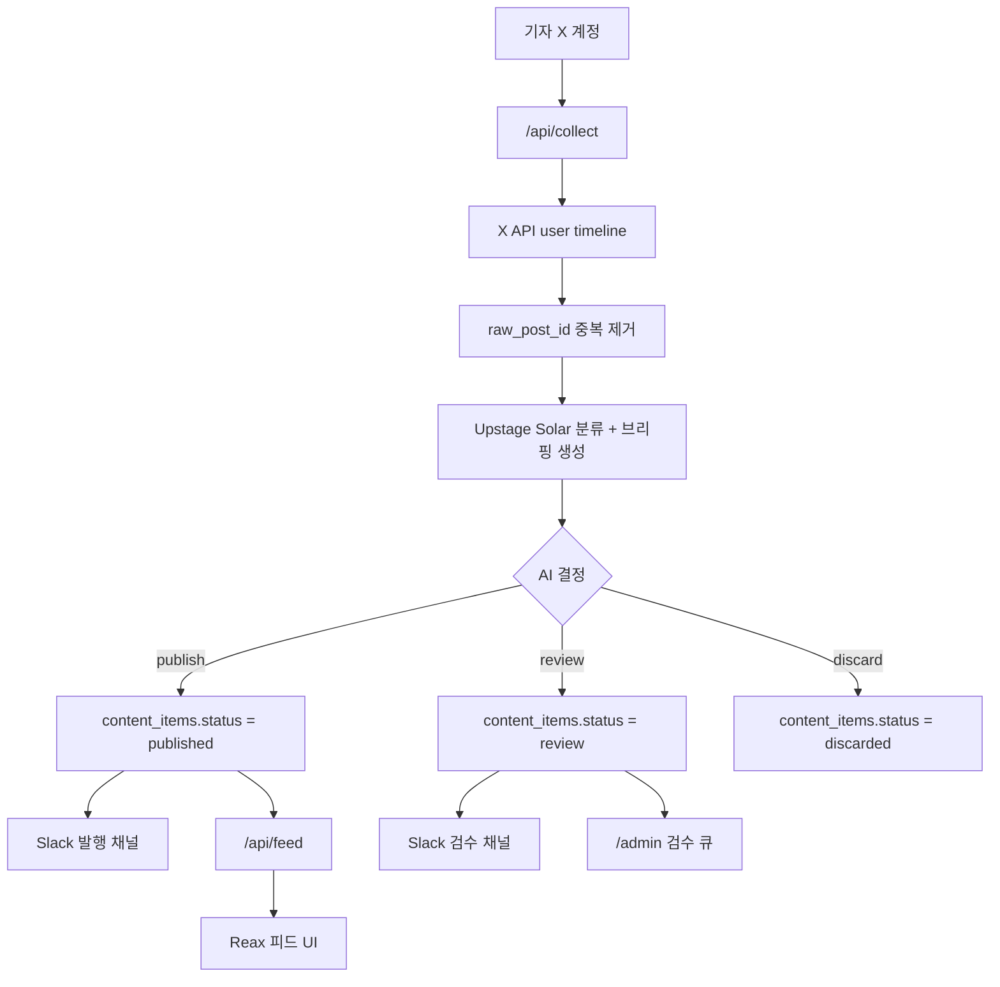

# P0 마스터 로드맵

## 제품 목표

직접 선정한 축구 기자 X 계정의 글을 수집하고, 6개 EPL 팀 관련 글만 필터링한 뒤, AI가 분류와 한국어 브리핑을 생성한다. 확실한 오피셜만 자동 발행하고, 루머나 애매한 글은 관리자 검수 큐로 보낸다. 배포는 무료 서버 구성을 기준으로 한다.

대상 팀:

- `MUN`: 맨체스터 유나이티드
- `MCI`: 맨체스터 시티
- `LIV`: 리버풀
- `ARS`: 아스날/아스널
- `TOT`: 토트넘
- `CHE`: 첼시

## 현재 기준 상태

- 프론트엔드: React 18 + Vite + Tailwind.
- 기존 제품 UI: Reax EPL 피드 mock.
- 현재 작업 브랜치 구현:
  - 초기 Vercel API
  - Supabase 스키마
  - 관리자 UI
  - `/api/feed` 우선 조회 + mock fallback
- main에서 새로 들어온 기획 문서:
  - `content.md`: 한국어 브리핑 작성 규칙과 객관성 규칙
  - `REAX_기획서.md`: 제품 방향과 핵심 UX

## 목표 아키텍처

## 단계 게이트

- P1이 끝나기 전에는 수집 라우팅 로직을 확장하지 않는다.
- P2가 끝나기 전에는 API 필드나 DB 필드를 더 늘리지 않는다.
- P3가 끝나기 전에는 Slack과 Cron 검증을 완료로 보지 않는다.
- P4가 끝나기 전에는 관리자 검수 기능을 운영 가능하다고 보지 않는다.
- P5가 끝나기 전에는 live 콘텐츠 피드 UX를 판단하지 않는다.
- P6가 끝나기 전에는 MVP 배포 준비 완료로 보지 않는다.

## 전체 완료 기준

- `npm run build`가 통과한다.
- API 함수 문법 검사가 통과한다.
- API가 없거나 데이터가 없어도 기존 mock 피드가 동작한다.
- `/admin`이 `ADMIN_TOKEN`으로 큐 데이터를 조회할 수 있다.
- `/api/collect`를 반복 실행해도 중복 발행/중복 저장이 발생하지 않는다.
- Slack 발행/검수 채널에 올바른 알림이 간다.
- AI 출력은 `content.md` 기준을 따른다. 한국어만 사용하고, 원 트윗 사실만 쓰며, 배경/해석을 추가하지 않는다.

## MVP 범위 밖

- X API 외 스크래핑은 하지 않는다.
- Slack 안에서 승인/반려 버튼까지 만들지 않는다.
- 공유 토큰 이상의 인증 시스템은 만들지 않는다.
- 일반 사용자 계정 기능은 만들지 않는다.
- 유료 호스팅을 전제로 하지 않는다.
- 이미지/영상 이해는 별도 단계가 생기기 전까지 하지 않는다.
